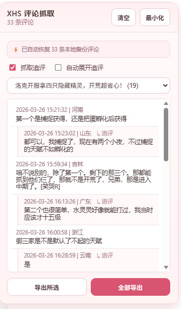

# XHS Comment Collector

一个辅助浏览小红书笔记时，同步采集评论的JS脚本。

脚本不会主动构造评论请求，也不会逆向评论接口加密参数，而是在用户正常浏览笔记页面时，监听页面自身已发出的评论响应，自动提取并保存评论数据，支持预览和 Excel 导出。

## 预览

## 功能

- 自动捕获当前浏览笔记的主评论
- 可选抓取追评 / 二级评论
- 可选自动展开回复，按间隔逐个点击按钮
- 自动提取标题、正文摘要、封面图链接
- 使用 IndexedDB 本地持久化，刷新后可恢复数据
- 支持单篇导出或多篇合并导出 `.xlsx`

## 安装

1. 安装 Tampermonkey、ScriptCat 或其他兼容的用户脚本扩展。
2. 将脚本上传到 GitHub 仓库。
3. 打开脚本文件的 Raw 链接进行安装，例如：`https://raw.githubusercontent.com/<用户名>/<仓库名>/<分支名>/xhs_comment_collector.js`
4. 浏览器脚本扩展会自动弹出安装页面，确认安装即可。
5. 后续更新脚本后，可通过同一 GitHub Raw 链接重新安装或覆盖更新。

## 使用

1. 打开任意笔记详情页。
2. 正常浏览评论区，脚本会自动收集主评论。
3. 需要二级评论时，勾选“抓取追评”。
4. 需要自动展开时，勾选“自动展开追评”。
5. 在右上角面板查看预览，并使用“导出所选”或“全部导出”。

## 声明

该脚本未逆向评论接口的加密参数，实现逻辑是在用户浏览时自动获取评论，并保存，且不会对服务器造成额外的开支。
该脚本仅用于学习，请勿用于非法用途。

## License

本项目使用 `MIT` License，详见 `LICENSE`。
